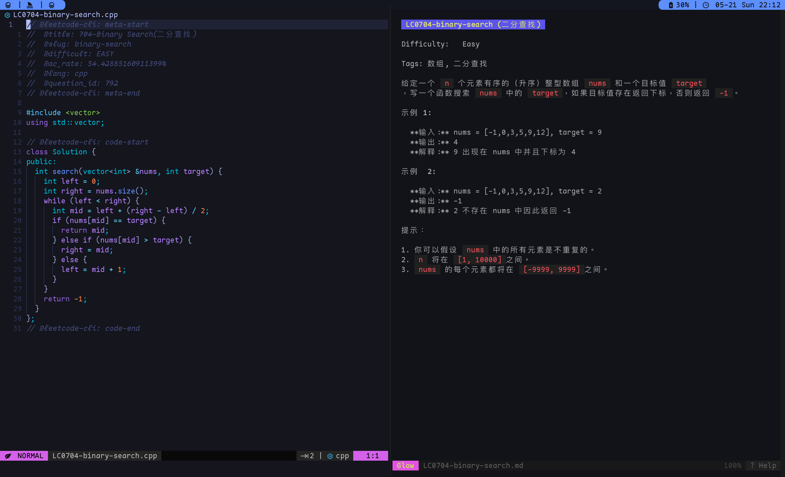

# LeetCode Cli

## 背景

### 我的需求

- 我不想在网页进行Coding
- 我想要在命令行中使用 `neovim` 刷题。
- 我想要在左边进行Coding，右边查看题目描述

### 现有的一些LeetCode工具

- [skygragon/leetcode-cli](https://github.com/skygragon/leetcode-cli): 貌似有一些问题，并且将Problem拉去下来的时候，问题描述是直接打印在命令行上的，这不太好
- vscode-leetcode, idea-leetcode: 不符合我的需求、我更希望我的所有操作尽量在命令行中
- 通用问题: 不管是 `leetcode.cn` 还是 `leetcode.com` ，都会频繁更改登陆方式, 使得登陆方式很容易失去维护

## 具体实现

- 使用Python实现，其中需要安装的依赖有：
    - `html2text`: 将 `HTML` 的内容转换为 `MarkDown` 语法
    - `fuzzywuzzy`: 提供对 Problem 序号的模糊搜索，如果不需要可以自行在 `common/utils.py` 中自行注释一下
    - `requests`: 发送HTTP请求
    - `browser_cookie3`: 获取浏览器的 Cookie

- 通过浏览器的 Cookie 实现对接口的鉴权: 我观察过其他LeetCode工具的实现，最头疼的就是 login 问题，几个仓库里面的 Issue 里的
  login 问题的讨论都十分激烈。我认为直接使用 Cookie
  进行请求是比较稳定的，唯一多了一个麻烦就是可能过一段时间需要手动去浏览器登陆一下，于我而言能够接受，也不得不接受，从其他LeetCode工具中的经验和代码来看，貌似他们现在也没办法直接登陆

## 使用方式

- 我认为Python的Argument Parser构建出来的help足以教会用户如何使用

> 由于依赖于浏览器Cookie，所以说如果出现Cookie中的LEETCODE_SESSION过期的情况，只需要从浏览器中登陆一次即可

## Preview

以下是我日常使用的界面，这里使用了[glow](https://github.com/charmbracelet/glow)在命令行对生成的问题描述 `MarkDown`
文件进行渲染高亮，这是个很不错的GoLang编写的工具

## TODO

`leetcode-cli` 最初的想法就是我的个人日常工具，所以肯定有很多意料之外的问题，以及有一些我不常用但是也许其他人需要的
feature，我也只能够在这里列出能想到的以后我也许有机会用到的一些 feature

- 提供不同浏览器cookie的支持
- submission的支持
- 更多的用户信息？